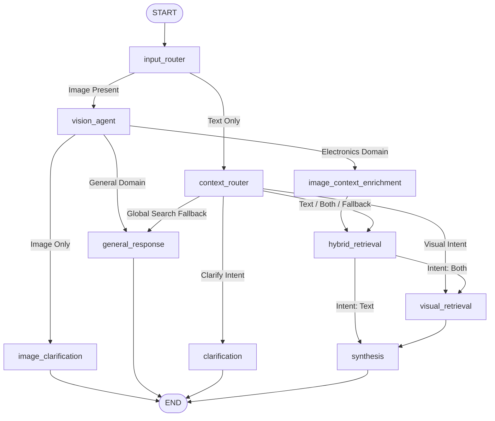

# Multimodal Electronics Assistant (Agentic RAG)

A state-of-the-art agentic Retrieval-Augmented Generation (RAG) system for Arduino and Raspberry Pi hardware documentation. This system handles text and image-based queries, performs hybrid search, retrieves wiring/pinout diagrams, and uses Google Gemini models orchestrated with LangGraph to synthesize accurate, verified responses.

---

## 🚀 Key Features

*   **Multimodal Queries:** Accepts text questions, image uploads (schematics, photos), or a combination of both.
*   **LangGraph Orchestration:** A robust agent workflow managing input routing, vision analysis, query enrichment, clarification loops, and confidence scoring.
*   **Hybrid Search Pipeline:** Combines **Dense Vector search** (via `pymilvus` with `all-MiniLM-L6-v2`) and **Sparse keyword search** (via `rank-bm25`) merged using **Reciprocal Rank Fusion (RRF)**.
*   **Visual Retrieval:** Employs **CLIP cross-modal search** (`clip-ViT-B-32`) to look up relevant technical diagrams and pinout diagrams.
*   **Response Caching & Sessions:** Features a thread-safe LRU cache for instant hits on repeated queries and SQLite-based conversational session management.
*   **Admin Dashboard:** A modern UI to upload documents (PDF, URL scraping), monitor database statistics, and trigger search-index hot reloading.

---

## 📐 System Architecture

The following Mermaid diagram shows the decision and routing paths inside the LangGraph StateGraph:



### Flow Components:
1.  **Input Router:** Determines whether to direct the request to the Vision Agent or the Context Router based on image presence.
2.  **Vision Agent:** Uses Gemini Vision to classify the domain (electronics vs. general) and extract component metadata from the image.
3.  **Context Router:** Decides user intent (Clarify, Text, Visual, or Both).
4.  **Hybrid Retrieval:** Runs sparse (BM25) and dense (Milvus Lite) queries and merges results via Reciprocal Rank Fusion (RRF).
5.  **Visual Retrieval:** Queries Milvus for relevant circuit diagrams or schematics using CLIP embeddings.
6.  **Synthesis & Validation:** Combines retrieved sources, checks text-matching confidence, and prompts Gemini to compile the final response. Generates loopbacks if the context is insufficient.

---

## 📁 Project Structure

```text
├── admin/                  # Administrative services
│   ├── hot_reload.py       # Re-loads model indices and weights
│   ├── ingestion_service.py# Coordinates parser/scraper/embedder steps
│   └── registry.py         # SQLite-based document tracking
├── agents/                 # Core LangGraph agent logic
│   ├── clarification.py    # Prompts for missing query details
│   ├── context_router.py   # Intent classifier agent
│   ├── general_response.py # Direct LLM responses for general queries
│   ├── graph.py            # Graph construction & CLI execution
│   ├── hybrid_retrieval.py # Text vector + keyword retrieval
│   ├── input_router.py     # Image input router
│   ├── state.py            # LangGraph agent state definitions
│   ├── synthesis.py        # Answer synthesis & confidence checks
│   ├── vision_agent.py     # Gemini Vision parser
│   └── visual_retrieval.py # CLIP diagram searcher
├── api/                    # FastAPI web server
│   ├── routes/             # Endpoints (chat, images, admin)
│   ├── cache.py            # Thread-safe response cache
│   ├── main.py             # Server entrypoint and warmup logic
│   └── session.py          # Session history manager
├── data/                   # Raw documents, extracted images & databases
│   ├── raw_pdfs/           # PDF files to ingest
│   ├── raw_html/           # Scraped HTML web documentation
│   ├── chunks/             # Processed texts and metadata JSONL
│   ├── images/             # Visual figures and schematics
│   └── admin_registry.db   # SQLite DB tracking registered files
├── embeddings/             # Models and builders
│   ├── bm25_builder.py     # Serializes BM25 corpus index
│   ├── image_embedder.py   # Computes CLIP image vectors
│   ├── milvus_loader.py    # Populates Milvus Lite databases
│   └── text_embedder.py    # Computes MiniLM text vectors
├── frontend/               # Single-page App (React + Vite + TailwindCSS/Vanilla)
│   ├── src/                # Front-end components, pages & routes
│   └── package.json        # Frontend dependencies
├── ingestion/              # Ingestion utilities
│   ├── chunker.py          # Semantic & character chunkers
│   ├── pdf_parser.py       # PyMuPDF text & diagram parser
│   ├── web_scraper.py      # Requests/BeautifulSoup scraper
│   └── ingest_pipeline.py  # Master ingestion run script
└── requirements.txt        # Backend dependencies
```

---

## 🛠️ Getting Started

### Prerequisites

*   Python 3.10+
*   Node.js v18+ & npm
*   Google Gemini API Key

### 1. Environment Setup

Clone the project and create a `.env` file in the root directory:

```env
GOOGLE_API_KEY=your_gemini_api_key_here
GEMINI_MODEL=gemini-2.5-flash
GEMINI_RPM_LIMIT=4

# Model overrides
CONTEXT_ROUTER_MODEL=gemini-2.5-flash-lite
CLARIFICATION_MODEL=gemini-2.5-flash-lite
SYNTHESIS_MODEL=gemini-2.5-flash
GENERAL_RESPONSE_MODEL=gemini-2.5-flash-lite
VISION_MODEL=gemini-2.5-flash

DEBUG=true
ADMIN_SECRET_KEY=your_admin_secret_key
```

### 2. Backend Installation

Create a virtual environment and install the required dependencies:

```bash
# Create venv
python -m venv venv
venv\Scripts\activate  # Windows
# or: source venv/bin/activate  # macOS/Linux

# Install requirements
pip install -r requirements.txt
```

### 3. Run Ingestion Pipeline (Offline ingestion)

To populate the local vector search database and serialize keyword indices:

```bash
# Run full ingestion (PDF parsing, Web scraping, Chunking)
python ingestion/ingest_pipeline.py
```

To load chunks and images into the Milvus vector database and build the BM25 index, run:

```bash
# Generate text/image embeddings & save to Milvus Lite and BM25 index
python embeddings/milvus_loader.py
python embeddings/bm25_builder.py
```

### 4. Run the Backend Server

Start the FastAPI application on port `8000`:

```bash
uvicorn api.main:app --reload --host 0.0.0.0 --port 8000
```
On startup, the backend pre-warms all local embedding models (MiniLM, CLIP) and pre-compiles the LangGraph workflow to ensure low first-request latencies.

### 5. Frontend Client Installation & Startup

Navigate to the `frontend/` directory, install packages, and start the Vite dev server:

```bash
cd frontend
npm install
npm run dev
```
Open `http://localhost:5173` in your browser.

---

## 🧪 Testing & Validation

The project includes several test suites to verify backend functionality:

### Unit & Integration API Tests
Verify endpoint status codes, session management, image serving, and LangGraph response structures:
```bash
python -m unittest tests/test_api.py
```

### Hybrid Retrieval & CLIP Search Tests
Evaluate dense/sparse ranking and cross-modal image lookup:
```bash
python tests/test_retrieval.py
```

### Interactive Agent Graph Test
Interactively query the LangGraph orchestrator or run test queries via CLI:
```bash
# Run interactive chat loop in the console
python agents/graph.py

# Run all 5 test scenarios (Text, Visual, Mixed, Clarification, Loopback)
python agents/graph.py --all
```

---

## 📄 License
This project is licensed under the MIT License.
